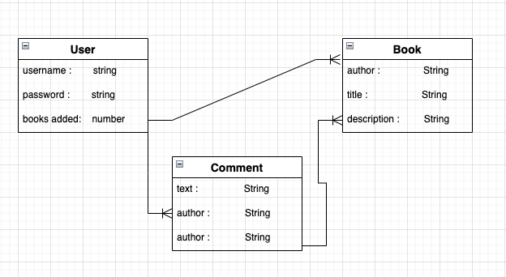

# Project2-My-Library
> This is a little library with a user that login with google account to the page,Then user go to the welcome page with his/her name shown on the page . The user will be then be shown an index of available books at that library. The user will be able to select a book by clicking on it. This will take th user to a page showing more information about the book. The user can then comment and can delete  the comment. User is to be able to add books to the library themselves.

<https://github.com/masinakhjiri/Project2-My-Library>

<http://sei-my-library.herokuapp.com/>

# User stories
## MVP Goals
* As a user,I want to sign up and login to app.
* As a user, I want to be able to see the list of books available in library.
* As a user,I want to see the details of the book that I've clicked on it.
* As a user,I want put a comment about that book.
* As a user,I want to delete a book that I add on my wishlist.
* As a user,I want to be able delete  my comments.

## Stretch Goals
* As a user,I want to add some API to search the books and find the book I look for that.
* As a user,I want to add another user as an admin.

## List of Mongoose models and their properties
Three Models:

1. Book
2. User
3. comments

# Wireframes

# ERD

# Technologies Used 
- Nodejs
- Express

